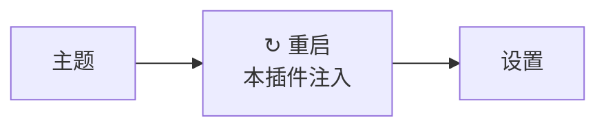

# dsh-restart-button   

> 一句话定位：它把"回命令行 Ctrl+C 再重新 dsh web，然后手动刷新浏览器"这一串动作，变成网页右上角点一下按钮，给经常装插件改配置、被重启折腾烦了的人用。


| 项 | 改造前 | 改造后 |
| --- | --- | --- |
| 重启操作 | 关终端 → 敲 `dsh web` → 等端口起来 | 点一下按钮 |
| 后台启动的 DSH | 压根没有终端窗口可 `Ctrl + C` | 照样能重启 |
| 浏览器页面 | 手动刷新，还可能 401 要重新登录 | 页面自动跳转，恢复到登录态 |
| 端口 | 重新敲命令容易忘带 `--port` | 助手沿用**原端口**，书签不用改 |
| 新标签页 | 可能突然弹出新窗口 | 带 `--no-open`，不弹 |
| 改插件源码的闭环 | 改一次、切窗口、重启、再改 | 改完直接点重启，闭环在浏览器里 |

## 适合谁 / 不适合谁

- 适合：如果你**经常装插件 / 改配置**，重启 `dsh web` 是家常便饭；你的 DSH 是**后台启动**的（用 `.vbs` / `.bat` 无窗口拉起，没有终端可 `Ctrl + C`）；你受够了"重启后页面 401，要手动刷新甚至重新登录"；或者你在用 `link:` 装插件改源码，需要**改一次重启一次**快速验证。
- 不适合：如果你的 DSH 一直开着不动、几乎不重启；或者你把 DSH 部署在**远程服务器**上给别人访问——本插件的重启接口**只允许本机页面触发**，远程访问点它会被直接 `403` 拒绝。这场景建议改用 SSH + 进程管理器（如 `pm2` / `systemd`）自行包装重启。
- 本插件**不做**：不做进程守护或崩溃自愈（只在**你点的时候**重启一次）；不做开机自启；不管端口冲突的排查；不开放任何远程访问入口。

## 安装

### 前置条件

| 项目 | 要求 | 说明 |
| --- | --- | --- |
| Node.js | **≥ 18** | 插件用 `node:net` / `node:child_process`，随 DSH 运行 |
| pnpm | 较新版本即可 | `dsh plugin` 的剩余参数会**原样转发给 pnpm**；缺它先 `npm i -g pnpm` |
| DSH | 已安装 `@deepseek-ai/dsh`，且能跑起 `dsh web` | 本插件的宿主。DSH（DeepSeek Harness）是一个**跑在你自己电脑上**的 AI 工作台，自带网页界面，可用插件扩展 |
| 访问方式 | 通过 `http://127.0.0.1:<端口>` 或 `http://localhost:<端口>` | 重启接口有回环校验，非回环地址会被 403 拒绝 |
| 操作系统 | Windows / macOS / Linux | 无平台特有代码；Windows 下助手进程不弹黑框 |

### 该选哪种方式

| 方式 | 适用场景 | 代价 |
| --- | --- | --- |
| GitHub 直装 | 只想用，不改代码 | 更新可能滞后 |
| `link:` 本地开发 | 调试 / 改源码 / 提 PR | 需 Node + 构建环境 |
| Download ZIP | 离线 / 锁版本 | 不自动更新 |

<details><summary>方式一：GitHub 直装（推荐，完整步骤）</summary>

```bash
dsh plugin --profile web add github:xinshang777/dsh-restart-button
```

安装成功后 `dsh plugin` 会把包登记进 profile 的 `dsh.profile.bundles`，**不需要手动改配置**。

> 😅 第一次装的时候当然还得手动重启一次——**从第二次开始**就能用按钮了。

</details>

<details><summary>方式二：link: 本地开发（改源码 / 提 PR 走这条）</summary>

```bash
git clone https://github.com/xinshang777/dsh-restart-button.git
cd dsh-restart-button
dsh plugin --profile web add link:.
```

这个插件本身**很适合用 `link:` 装**——改完 `assets/client.js` 或 `lib/*`，直接点按钮重启就能验证改动，形成闭环。注意宿主侧（`lib/*`）的改动**必须重启**才生效，前端侧硬刷新即可。

</details>

<details><summary>方式三：Download ZIP（离线 / 锁版本）</summary>

1. 打开仓库页面 → **Code → Download ZIP**，解压到任意目录；
2. 在该目录执行 `dsh plugin --profile web add link:.`；
3. 重启 `dsh web`。

⚠️ 此方式不会自动更新，升级要重新下载。

</details>

### 重启说明

| 场景 | 是否需要重启 |
| --- | --- |
| 新装 / 卸载本插件 | ✅ 需要（第一次必须手动重启） |
| 改 `~/.dsh/profiles/web/cordis.patch.yml` | ✅ 需要 |
| 改 `link:` 安装的插件源码（`lib/*`） | ✅ 需要，**用本插件的按钮即可** |
| 改本插件的前端 `assets/client.js` | ❌ 不需要重启，硬刷新 `Ctrl + F5` |
| 只是聊天、切会话 | ❌ 不需要 |
| 从别的电脑访问时点了按钮 | 不会重启，会返回 `403`（刻意的安全设计） |

> 💡 装了本插件之后，**从第二次起**所有需要重启的场景都可以用按钮代替命令行。

### 三十秒验证成功

打开 `dsh web` 并按 **F5** 硬刷新一次 → 看到**右上角「设置」左边多出 `↻ 重启` 按钮** = 装好了。



如果没看到按钮，按顺序查三步：① `~/.dsh/profiles/web/package.json` 的 `dsh.profile.bundles` 数组里有没有 `dsh-restart-button`；② **硬刷新**（`Ctrl + F5`）——注入脚本是随 HTML 加载的；③ 完整重启一次 `dsh web`。

## 使用教程

1. **找到按钮** —— 浏览器打开 `dsh web`，按 `F5` 硬刷新一次，看界面右上角 **「设置」的左边**：`[ 主题 ] [ ↻ 重启 ] [ 设置 ]`。
2. **点它** —— 点击后按钮进入"重启中"状态。整个过程**不需要你操作浏览器**：

   ```mermaid
   sequenceDiagram
       participant U as 你（浏览器）
       participant O as 旧 dsh web 进程
       participant H as 重启助手
       participant N as 新 dsh web 进程

       U->>O: POST /dsh-restart/restart
       O-->>U: 200 ok + bootId
       O->>H: 拉起助手（detached）
       Note over O: 250ms 后旧进程退出
       H->>H: 轮询端口，等旧进程释放
       H->>N: 用原端口重新启动
       H-->>H: 400ms 后助手自行退出
       U->>N: 轮询 /dsh-restart/status
       N-->>U: bootId 变了 + 带新 token 的 URL
       Note over U: 页面自动跳转，恢复登录态
   ```

3. **确认成功** —— 页面重新出现、且**不需要你重新登录**，就说明成功了。
4. **什么时候用它** —— 新装或卸载插件、改 `cordis.patch.yml`、改 `link:` 装的插件源码（宿主侧）时都需要；只是聊天或切会话则不需要。

**配置项**

本插件**不读取任何配置项**（`cordis.patch.yml` 里没有 `config:`），行为完全由 DSH 自身的启动参数决定。下表列出你可能想调整、但需要改的是 DSH 启动命令而不是本插件配置的值：

| 名称 | 类型 | 默认值 | 是否必填 | 作用 |
| --- | --- | --- | --- | --- |
| （无） | — | — | — | 本插件不提供配置项 |
| `--port` | number | `3080`（DSH 默认） | 否 | DSH 启动端口；重启时助手会**沿用原端口**，改端口请改 DSH 启动命令 |
| `--no-open` | flag | — | 否 | 助手重启新进程时**自动带上**，所以不会弹出新标签页 |

## 常见问题 / 排障

**1｜点了返回 `403 forbidden`**

- **原因**：你在**非回环地址**下访问——例如局域网 IP、反向代理、域名。重启是**有副作用的写操作**，如果任何网页都能触发，就是本地服务的经典攻击面（跨站请求 + DNS 重绑定可以伪装成 `127.0.0.1`），所以接口做了三层护栏并**默认拒绝**。
- **处理**：在本机 `http://127.0.0.1:<端口>` 或 `http://localhost:<端口>` 下使用。这是**刻意的安全设计，不是 bug**。如果你的 DSH 本来就要远程访问，请改用 SSH + 进程管理器做重启。

**2｜点了返回 `500 dsh bin.js not found`**

- **原因**：插件找不到 DSH 的入口文件。通常出现在非常规安装方式下（例如自定义启动脚本、把 DSH 包放在非标准位置）。
- **处理**：用官方 `dsh web` 命令启动 DSH；如果你确实需要自定义启动方式，请确认启动进程的 `execPath` / `argv` 能被插件正确读取。

**3｜重启后需要重新登录**

- **原因**：DSH 的连接层有一把**进程级启动 token**（每次启动都重新生成），沿用旧 URL 里的 token 就会 401。正常情况下 `/dsh-restart/status` 会把当前进程的**带 token 地址**回传，前端拿到后 `location.replace(url)`。若这一步拿不到（例如自定义了连接层），就会退化成跳到 `location.origin + '/'`，于是需要重新登录。
- **处理**：确认使用的是官方 DSH 与官方 `dsh web` 启动方式；若确实是自定义连接层，本插件无法覆盖该场景，退化为普通刷新后手动登录一次。

<details><summary>完整排障表</summary>

| 现象 | 处理 |
| --- | --- |
| 点了返回 `403 forbidden` | 你在非回环地址下访问（局域网 IP / 反向代理 / 域名）。这是刻意设计：只允许本机页面触发。请用 `http://127.0.0.1:<端口>` 或 `http://localhost:<端口>`。 |
| 点了返回 `405` | 接口只接受 `POST`。多半是你在浏览器地址栏直接访问了 `/dsh-restart/restart`。 |
| 点了返回 `500 dsh bin.js not found` | 插件找不到 DSH 入口文件。通常出现在非常规安装方式下；请用官方 `dsh web` 启动。 |
| 按钮点了没反应，页面也没跳 | ① 确认是本机浏览器访问；② 打开控制台看有没有 JS 报错；③ 再等几秒（等端口释放 + 新进程启动）。 |
| 重启后需要重新登录 | `status` 接口没能拿到本进程的 `authenticatedUrl`（例如自定义了连接层），退化为普通刷新并可能需要重新登录一次。 |
| 页面上完全没有按钮 | ① 确认 `bundles` 里有 `dsh-restart-button`；② **硬刷新** `Ctrl + F5`；③ 完整重启一次 `dsh web`。 |
| 改了插件源码但按钮还是旧的 | `client.js` 带 `no-store`，但仍建议硬刷新；宿主侧（`lib/*`）改动**必须重启**才生效。 |
| 重启后端口变了 | 助手会用 `--port <原端口>` 启动新进程，正常不会变；若端口被其他程序抢占，请先释放端口。 |

</details>

## 兼容性与已知限制

- **宿主最低版本**：Node.js **≥ 18**；需要能跑起 `dsh web` 的 DSH（用到 `webServer.register` / `webServer.tapIndex`、连接层的 `authenticatedUrl`）。
- **平台差异**：功能跨平台一致；Windows 下助手进程带 `windowsHide: true`，**不会弹出黑框**。其余平台无特殊处理。
- **冲突插件**：未发现硬冲突。需要注意的是——如果**其他插件也用了 `webServer.tapIndex()` 往 `</body>` 前插脚本**，两者会叠加而不互斥（本插件用 `html.includes(CLIENT_PATH)` 保证自己不重复注入，但不会阻止别人注入）。
- **已知限制**：只做"重启一次"，**不是守护进程**——进程崩溃后它不会自动拉起；重启接口**只能本机触发**，远程场景不可用；`bootId` 依赖进程启动时间，系统时间被大幅回拨时理论上可能碰撞（概率极低，仅作提示）。

## 升级、卸载与数据

- **配置存放位置**：本插件**不落任何配置文件**，也不写数据库。它的全部"状态"都在内存里（`BOOT_ID` 随进程生成）。唯一涉及的路径是它提供的三个路由，随插件卸载一并消失。
- **升级**：
  - `github:` 方式：重跑一次 `dsh plugin --profile web add github:xinshang777/dsh-restart-button`；
  - `link:` 方式：`git pull` 后**点一下重启按钮**即可（正好用上它自己）。
- **干净卸载**：
  ```bash
  dsh plugin --profile web remove dsh-restart-button
  ```
  因为不落文件、不写注册表、不写系统目录，**卸载后无任何残留**；唯一影响是重启又要回命令行（或手动刷新 `~/.dsh/profiles/web/package.json` 后重启）。
- **回滚**：`link:` 方式 `git checkout <上一个 tag 或 commit>` 后手动重启一次；`github:` 方式换成旧 tag 重装。无数据需要迁移。

## 隐私

- **数据是否出本机**：**不出**。插件不发起任何外部网络请求，工作方式完全是本机进程内的 spawn 与端口轮询。
- **是否联网**：**不联网**。唯一涉及网络的行为是**本机回环轮询** `GET /dsh-restart/status`。
- **是否读取账号**：**不读**。它不碰账号、不读登录态文件；只在重启后向页面回传**本进程**的连接地址（含本进程启动 token），这个 token 只发给发起重启的那个页面。
- **需要知情的一点**：`/dsh-restart/status` 会把带 token 的地址返回给调用方。三重护栏（回环 Host + `Sec-Fetch-Site` + Origin 一致性）就是为了确保这个接口**只可能被本机同源页面**拿到，跨站页面与 DNS 重绑定都会被 403 挡掉。

## 实现原理（贡献者向）

<details><summary>挂钩点 · 数据流 · 接口表 · 目录结构</summary>

**挂钩点 1：`ctx.webServer.tapIndex()` 注入前端脚本**

插件不要求你改 DSH 前端代码，而是挂钩页面 HTML，往 `</body>` 前插入一行脚本：

```js
ctx.webServer.tapIndex(html =>
  html.includes(CLIENT_PATH) ? html : html.replace('</body>', `<script defer src="${CLIENT_PATH}"></script></body>`)
)
```

脚本本体由插件自己的路由 `/dsh-restart/client.js` 提供，并带 `Cache-Control: no-store`，保证每次都是最新版本。前端脚本负责：**画按钮 → 点击发请求 → 轮询状态 → 自动跳转**。

**挂钩点 2：三重护栏（fail-closed）**

重启是**有副作用的写操作**，所以每个接口进来先过 `guard()`，**默认拒绝**：

```js
function guard(req, res) {
  // ① Host 必须是回环地址：localhost / *.localhost / ::1 / 127.0.0.0/8
  //    其他主机名 → 403（DNS 重绑定会在这里被挡住，因为 Host 是域名而非回环地址）
  // ② Sec-Fetch-Site == 'cross-site' → 403（浏览器主动声明跨站）
  // ③ 有 Origin 时，Origin 的 host 必须与 Host 完全一致 → 否则 403
}
```

**接口表**

| 方法 | 路径 | 用途 |
| --- | --- | --- |
| `POST` | `/dsh-restart/restart` | 触发重启（**只接受 POST**，其他方法返回 `405` + `Allow: POST`） |
| `GET` | `/dsh-restart/status` | 返回 `{ ok, bootId, pid, url }`，前端靠它判断新进程是否就绪 |
| `GET` | `/dsh-restart/client.js` | 提供前端脚本（带 `no-store`） |

`bootId` 的生成方式朴素但够用——**每次进程启动都不同**，所以前端只要发现它变了，就知道"新进程已经接管"：

```js
const BOOT_ID = `${process.pid.toString(36)}-${Date.now().toString(36)}`
```

**重启后为什么还能保持登录**

DSH 的连接层有一把**进程级启动 token**，沿用旧 token 的结果就是 401。所以 `/dsh-restart/status` 回传**当前进程**的有效地址：

```js
const conn = ctx.get('connection') || ctx.connection
const url = conn.authenticatedUrl('http://' + req.headers.host + '/')   // 本进程的有效地址
res.end(JSON.stringify({ ok: true, bootId: BOOT_ID, pid: process.pid, url }))
```

前端拿到 `url` 后 `location.replace(url)`，而不是天真地 `location.reload()`（那会被 401 挡住）。

**怎么做到"旧进程能退出、新进程不被带走"**

这是最容易翻车的地方，步骤被刻意拆成两段。

① 旧进程侧（`lib/index.js` 的 `scheduleRestart`）

```js
const child = spawn(process.execPath, [helper], {
  detached: true,        // 脱离父进程组，不受旧进程退出影响
  stdio: 'ignore',
  windowsHide: true,     // Windows 不弹黑框
  shell: false,          // 不经过 cmd.exe，避免多一层壳
  env,                   // 重启参数通过 DSH_RESTART_BTN 传给助手
})
child.unref()
setTimeout(() => process.exit(0), 250)   // 先把 200 响应刷出去，再退出
```

② 助手侧（`lib/restart-web.js`）

```js
await waitFree()          // 轮询端口（120ms 一次，最多等 30s），等旧进程让出端口
const child = spawn(info.execPath, info.argv, { detached: true, windowsHide: true, shell: false })
child.unref()
await new Promise(r => setTimeout(r, 400))   // 等新进程脱离 job 对象
process.exit(0)                              // 助手自己退出，不带走新进程
```

两个细节：**端口复用**——`argv` 里带上了 `--port <原端口>` 和 `--no-open`，所以新进程用同一个地址，书签不用改、也不会弹出新标签页；**超时也继续拉起**——如果 30 秒内端口一直没释放，助手仍会尝试启动新进程，因为旧进程此时可能正在优雅退出、端口随后就能复用。

**数据流**

```
点按钮 → POST /dsh-restart/restart
  ├─ guard() 三重校验（回环 / 非跨站 / Origin 一致），失败即 403
  ├─ 响应 200 { ok, bootId }
  └─ spawn 助手（detached, unref）→ 250ms 后旧进程 exit
        └─ 助手：waitFree() → spawn 新 dsh web(--port 原端口 --no-open)
              └─ 400ms 后助手 exit
页面轮询 GET /dsh-restart/status → bootId 变化 + 新 url → location.replace(url)
```

**目录结构**

```text
dsh-restart-button/
├── lib/
│   ├── index.js        # 宿主侧：三重护栏、三个路由、tapIndex 注入、拉起重启助手
│   └── restart-web.js  # 独立助手：等端口释放 → 用原参数重新启动 dsh web
├── assets/client.js    # 浏览器侧：画按钮、发请求、轮询 bootId、自动跳转
├── cordis.patch.yml    # bundle 挂载声明
└── package.json
```

零运行时依赖，只用 Node 内置的 `node:net` / `node:child_process`。

</details>

详见 `docs/architecture.md`

## 贡献与反馈

[CONTRIBUTING.md](CONTRIBUTING.md) · [CHANGELOG.md](CHANGELOG.md) · Issue 模板

改动护栏逻辑（`guard()`）时请特别谨慎：它同时是安全边界和"远程访问会被拒绝"这一行为契约的来源，改完请同步更新本文档的[兼容性与已知限制](#兼容性与已知限制)与排障条目。

## 许可证

MIT — 见 [LICENSE](LICENSE)
