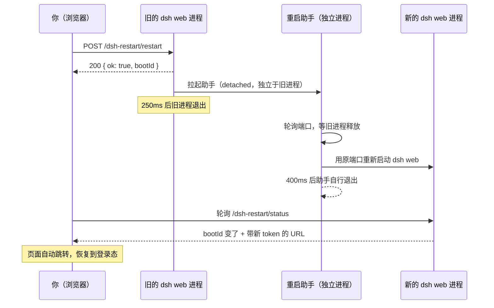

<div align="center">

# dsh-restart-button

**给 DSH 网页界面加一个"一键重启"按钮。**

装完插件、改完配置后不用再回到命令行 `Ctrl + C` 再 `dsh web`——
点一下按钮，服务重启，**页面自己恢复到登录状态**。

[](LICENSE)
[](https://github.com/deepseek-ai/deepseek-harness)
[](#三安装)

</div>

---

## 先花 30 秒搞懂它是什么

| 名词 | 白话解释 |
|---|---|
| **DSH** | DeepSeek Harness（npm 包 `@deepseek-ai/dsh`），**跑在你自己电脑上**的 AI 工作台，自带网页界面。 |
| **`dsh web`** | 启动这个网页界面的命令，本质是一个本地 Node 进程（默认端口 3080）。 |
| **本插件** | 一个 DSH 插件。装上后，**网页右上角「设置」旁边多出一个重启按钮**。 |

**为什么需要它？** 因为 DSH 的插件、配置改动**都要重启进程才生效**，而重启意味着：
关终端 → 重新敲命令 → 等端口起来 → 浏览器重新打开 → 因为进程级启动 token 变了，**还得再登录/刷新一次**。
这个插件把这一串动作压成**一次点击**。

---

## 一、适用范围（谁该用它）

**适合你，如果：**

- 你**经常装插件 / 改配置**，重启 `dsh web` 是家常便饭；
- 你的 DSH 是**后台启动**的（用 `.vbs` / `.bat` 无窗口拉起，压根没有终端窗口可 `Ctrl + C`）；
- 你受够了"重启后页面 401，得手动刷新甚至重新登录"；
- 你在改插件源码（`link:` 方式安装），需要**改一次重启一次**快速验证。

**不适合你，如果：**

- 你的 DSH 一直开着不动，几乎不重启；
- 你把 DSH 部署在**远程服务器**上给别人访问——本插件的重启接口**只允许本机页面触发**
  （详见[实现原理](#五实现原理)），远程访问点它会直接被 403 拒绝。这是刻意的安全设计，不是 bug。

---

## 二、它能做什么（通俗版）

装上之后，界面顶部原来是这样：

```text
                                    [ 主题 ]  [ 设置 ]
```

现在变成这样：

```text
                                    [ 主题 ]  [ ↻ 重启 ]  [ 设置 ]
                                                 ↑ 本插件注入
```

点下去会发生什么：



一句话总结它解决的问题：

| 没有它 | 有它 |
|---|---|
| 关终端 → `dsh web` → 等 → 手动刷新浏览器 → 可能还要登录 | **点一下按钮，等几秒，页面自己回来** |

---

## 三、安装

### 前置条件

| 项 | 要求 |
|---|---|
| Node.js | 18 或更高 |
| pnpm | `npm i -g pnpm` |
| DSH | `npm i -g @deepseek-ai/dsh`，装完能跑起 `dsh web` |

### 方式 A：直接从 GitHub 安装（推荐）

```bash
dsh plugin --profile web add github:xinshang777/dsh-restart-button
```

### 方式 B：克隆到本地再以链接方式安装（想改代码时用）

```bash
git clone https://github.com/xinshang777/dsh-restart-button.git
cd dsh-restart-button
dsh plugin --profile web add link:.
```

> 这个插件本身**很适合用 `link:` 装**——你改完 `assets/client.js` 或 `lib/*`，
> 直接点按钮重启，就能验证改动，形成闭环。

### 方式 C：只想下载

仓库页面 → **Code** → **Download ZIP**。

### 安装后必须重启

```bash
# 停掉 dsh web（Ctrl + C），然后
dsh web
```

> 😅 第一次装的时候当然还得手动重启——**从第二次开始**就能用按钮了。

### 重启后没看到按钮？检查这一处

`dsh plugin add` 安装成功后**会自动**把插件登记进 profile 的 `dsh.profile.bundles`，正常无需手动改配置。

若重启后没出现按钮，打开 `~/.dsh/profiles/web/package.json`，确认 `dsh.profile.bundles` 里有 `dsh-restart-button`：

```jsonc
{
  "dsh": {
    "profile": {
      "bundles": [
        "@deepseek-ai/dsh-base",
        "@deepseek-ai/dsh-web-app",
        "dsh-restart-button"     // ← 有这一项才算已挂载
      ]
    }
  }
}
```

没有就手动补上并重启。

---

## 四、使用教程

### 第 1 步：找到按钮

浏览器打开 `dsh web`，按 **F5** 硬刷新一次（注入脚本是随页面加载的），
然后看界面右上角 **「设置」的左边**：

```text
[ 主题 ]  [ ↻ 重启 ]  [ 设置 ]
            ↑
      点这里
```

### 第 2 步：点它

点击后按钮会进入"重启中"状态。整个过程**不需要你操作浏览器**：

1. 旧进程退出（约 0.25 秒后）；
2. 助手等端口释放（通常 1–3 秒）；
3. 新进程用**原来的端口**启动；
4. 页面轮询到 `bootId` 变化 → **自动跳转**到带新 token 的地址。

### 第 3 步：确认成功

页面重新出现、且**不需要你重新登录**，就说明成功了。

如果按钮点了没反应：先确认在**本机浏览器**里打开（不是从别的电脑访问），
再打开浏览器控制台看有没有报错。

### 什么时候用它

| 场景 | 是否需要重启 |
|---|---|
| 新装 / 卸载插件 | ✅ 需要 |
| 改 `~/.dsh/profiles/web/cordis.patch.yml` | ✅ 需要 |
| 改 `link:` 安装的插件源码 | ✅ 需要 |
| 只是聊天、切会话 | ❌ 不需要 |

---

## 五、实现原理

### 1. 按钮是怎么"长"到页面上的

插件不要求你改 DSH 的前端代码，而是用 `ctx.webServer.tapIndex()` 挂钩页面 HTML，
往 `</body>` 前插入一行脚本：

```js
ctx.webServer.tapIndex(html =>
  html.includes(CLIENT_PATH) ? html : html.replace('</body>', `<script defer src="${CLIENT_PATH}"></script></body>`)
)
```

脚本本体由插件自己的路由 `/dsh-restart/client.js` 提供，并带 `Cache-Control: no-store`，
保证每次都是最新版本。前端脚本负责：**画按钮 → 点击发请求 → 轮询状态 → 自动跳转**。

### 2. 三个接口

| 方法 | 路径 | 用途 |
|---|---|---|
| `POST` | `/dsh-restart/restart` | 触发重启（**只接受 POST**，其他方法返回 `405` + `Allow: POST`） |
| `GET` | `/dsh-restart/status` | 返回 `{ ok, bootId, pid, url }`，前端靠它判断新进程是否就绪 |
| `GET` | `/dsh-restart/client.js` | 提供前端脚本 |

`bootId` 的生成方式很朴素但够用：

```js
const BOOT_ID = `${process.pid.toString(36)}-${Date.now().toString(36)}`
```

**每次进程启动都不同**，所以前端只要发现 `bootId` 变了，就知道"新进程已经接管"。

### 3. 三重护栏：为什么这个接口不能被随便调

重启是**有副作用的写操作**，如果任何网页都能触发，就是本地服务的经典攻击面
（跨站请求 + DNS 重绑定可以伪装成 `127.0.0.1`）。所以每个接口进来先过 `guard()`，
**fail-closed（默认拒绝）**：

```js
function guard(req, res) {
  // ① Host 必须是回环地址：localhost / *.localhost / ::1 / 127.0.0.0/8
  //    其他主机名 → 403（DNS 重绑定会在这里被挡住，因为 Host 是域名而非回环地址）
  // ② Sec-Fetch-Site == 'cross-site' → 403（浏览器主动声明跨站）
  // ③ 有 Origin 时，Origin 的 host 必须与 Host 完全一致 → 否则 403
}
```

不满足任意一条 → 直接 `403 forbidden`。这就是为什么
**从别的电脑访问你的 DSH、再点这个按钮会被拒绝**——这是设计如此。

### 4. 为什么"重启后还能保持登录"

DSH 的连接层有一把**进程级启动 token**（每次启动都重新生成）。
如果重启后沿用 URL 里的旧 token，结果就是 401。

所以 `/dsh-restart/status` 会把**当前进程**的带 token 地址回传：

```js
const conn = ctx.get('connection') || ctx.connection
const url = conn.authenticatedUrl('http://' + req.headers.host + '/')   // 本进程的有效地址
res.end(JSON.stringify({ ok: true, bootId: BOOT_ID, pid: process.pid, url }))
```

前端拿到 `url` 后 `location.replace(url)`，而不是天真地 `location.reload()`（那会被 401 挡住）。

### 5. 怎么做到"旧进程能退出、新进程不被带走"

这是最容易翻车的地方。步骤被刻意拆成两段：

**① 旧进程侧**（`lib/index.js` 的 `scheduleRestart`）

```js
const child = spawn(process.execPath, [helper], {
  detached: true,        // 脱离父进程组，不受旧进程退出影响
  stdio: 'ignore',
  windowsHide: true,     // Windows 不弹黑框
  shell: false,          // 不经过 cmd.exe，避免多一层壳
  env,                   // 重启参数通过 DSH_RESTART_BTN 传给助手
})
child.unref()
setTimeout(() => process.exit(0), 250)   // 先把 200 响应刷出去，再退出
```

**② 助手侧**（`lib/restart-web.js`）

```js
await waitFree()          // 轮询端口（120ms 一次，最多等 30s），等旧进程让出端口
const child = spawn(info.execPath, info.argv, { detached: true, windowsHide: true, shell: false })
child.unref()
await new Promise(r => setTimeout(r, 400))   // 等新进程脱离 job 对象
process.exit(0)                              // 助手自己退出，不带走新进程
```

两个细节值得注意：

- **端口复用**：`argv` 里带上了 `--port <原端口>` 和 `--no-open`，所以新进程用同一个地址，
  浏览器书签、收藏夹都不用改；也不会突然弹出一个新标签页。
- **超时也继续拉起**：如果 30 秒内端口一直没释放，助手仍会尝试启动新进程——
  因为旧进程此时可能正在优雅退出，端口随后就能复用。

### 6. 目录结构

```text
dsh-restart-button/
├── lib/
│   ├── index.js        # 宿主侧：三重护栏、三个路由、tapIndex 注入、拉起重启助手
│   └── restart-web.js  # 独立助手：等端口释放 → 用原参数重新启动 dsh web
├── assets/client.js    # 浏览器侧：画按钮、发请求、轮询 bootId、自动跳转
├── cordis.patch.yml    # bundle 挂载声明
└── package.json
```

零运行时依赖，只用 Node 内置的 `node:net` / `node:child_process`。

---

## 六、常见问题

| 现象 | 原因 / 处理 |
|---|---|
| 点了返回 `403 forbidden` | 你在**非回环地址**下访问（如局域网 IP、反向代理、域名）。这是刻意的安全设计：重启接口只允许本机页面触发。请在本机 `http://127.0.0.1:<端口>` 或 `http://localhost:<端口>` 下使用。 |
| 点了返回 `405` | 接口只接受 `POST`。多半是你在浏览器地址栏直接访问了 `/dsh-restart/restart`。 |
| 点了返回 `500 dsh bin.js not found` | 插件找不到 DSH 的入口文件。通常出现在非常规安装方式（例如自定义启动脚本）下；请用官方 `dsh web` 启动。 |
| 按钮点了没反应，页面也没跳 | ① 确认是本机浏览器访问；② 打开控制台看有没有 JS 报错；③ 再等几秒（等端口释放 + 新进程启动）。 |
| 重启后需要重新登录 | `status` 接口没能拿到本进程的 `authenticatedUrl`（例如自定义了连接层）。此时退化为普通刷新：页面会跳到 `location.origin + '/'`，可能需要重新登录一次。 |
| 页面上完全没有按钮 | ① 确认 `bundles` 里有 `dsh-restart-button`；② **硬刷新**（`Ctrl + F5`）——注入的脚本是随 HTML 加载的；③ 完整重启一次 `dsh web`。 |
| 改了插件源码但按钮还是旧的 | `client.js` 带 `no-store`，但仍建议硬刷新。宿主侧（`lib/*`）改动**必须重启**才生效。 |

---

## License

[MIT](LICENSE)
